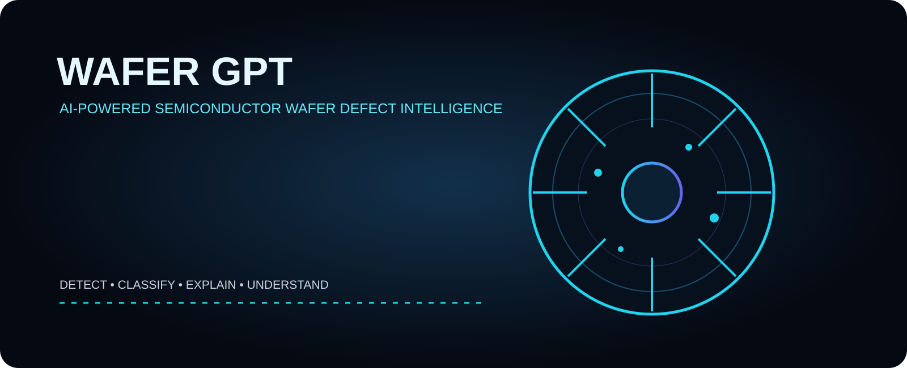
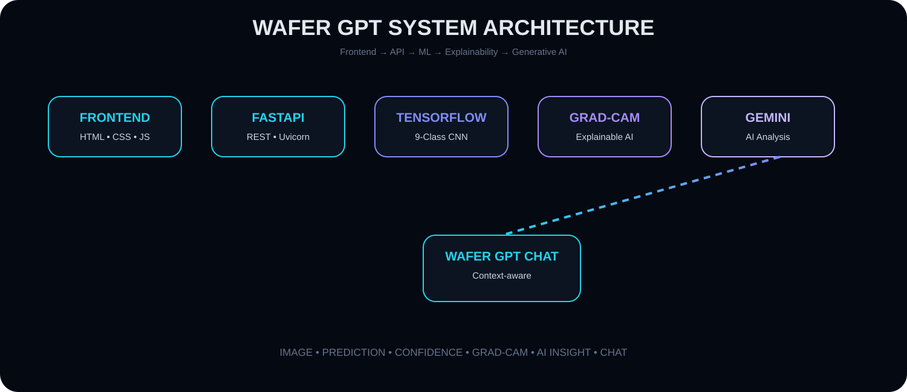
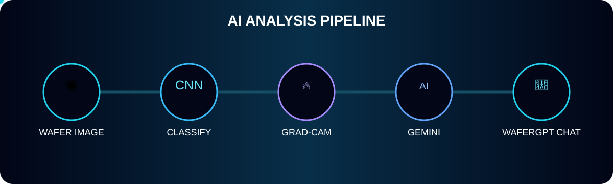
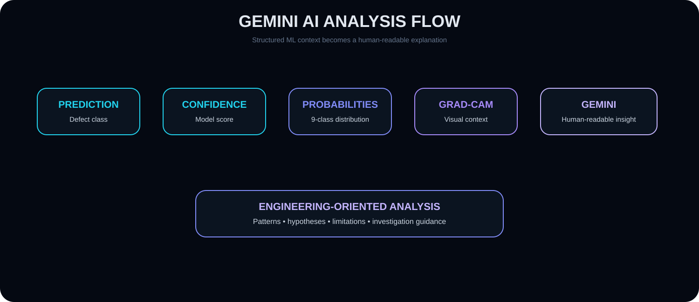
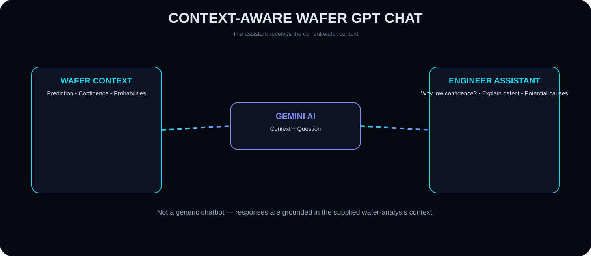
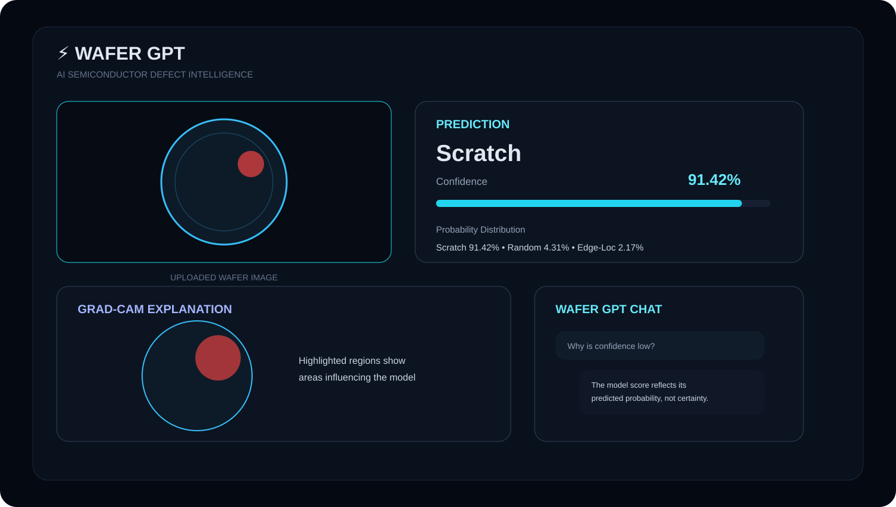

<div align="center">

# ⚡ WAFER GPT

### AI-Powered Semiconductor Wafer Defect Intelligence



<br/>


<br/><br/>

<a href="https://github.com/Harshitcodes154/WAFER-GPT">

</a>


<br/><br/>

### 🚀 Detect. Explain. Understand.

**WAFER GPT is an AI-powered semiconductor wafer defect intelligence platform that combines Deep Learning, Computer Vision, Grad-CAM Explainable AI and Google Gemini to analyze wafer patterns and generate human-readable insights.**

</div>

---

# 🧠 What is WAFER GPT?

**WAFER GPT** is an end-to-end AI system designed for intelligent semiconductor wafer defect analysis.

Instead of providing only a machine-learning classification, WAFER GPT creates a complete analysis pipeline:

```text
                ┌──────────────────────┐
                │     WAFER IMAGE      │
                └──────────┬───────────┘
                           │
                           ▼
                ┌──────────────────────┐
                │ IMAGE PREPROCESSING  │
                │   PIL + NumPy + CV   │
                └──────────┬───────────┘
                           │
                           ▼
                ┌──────────────────────┐
                │   TENSORFLOW / CNN   │
                │   DEFECT CLASSIFIER  │
                └──────────┬───────────┘
                           │
             ┌─────────────┼─────────────┐
             ▼             ▼             ▼
        PREDICTION     CONFIDENCE   PROBABILITIES
             │
             ▼
        ┌───────────────┐
        │   GRAD-CAM    │
        │ EXPLANABILITY │
        └───────┬───────┘
                │
                ▼
        ┌───────────────┐
        │   GEMINI AI   │
        │  EXPLANATION  │
        └───────┬───────┘
                │
                ▼
        ┌───────────────┐
        │ WAFER GPT CHAT│
        │   ASSISTANT   │
        └───────────────┘
🎯 Why WAFER GPT?

A traditional image classifier may return:

Prediction: Scratch

Confidence: 91.42%

But that alone doesn't answer important questions:

Why was this defect predicted?
Which region influenced the model?
What were the alternative predictions?
How confident is the model?
What does the detected pattern mean?
What should an engineer investigate?
Can the result be explained in natural language?

WAFER GPT attempts to bridge this gap.

💡 Core Idea

WAFER GPT follows a simple philosophy:

Don't just predict the defect. Explain the prediction.

The platform combines three major intelligence layers:

┌──────────────────────────────────────────────┐
│              WAFER GPT INTELLIGENCE          │
├──────────────────────────────────────────────┤
│                                              │
│  01  CNN                                     │
│      What is the defect?                     │
│                                              │
│  02  Grad-CAM                                │
│      Where did the model look?               │
│                                              │
│  03  Gemini                                  │
│      How can the result be understood?      │
│                                              │
└──────────────────────────────────────────────┘
🌌 System Architecture

🔄 Complete AI Pipeline


The complete workflow is:

Upload Wafer Image
        ↓
Validate Image
        ↓
Save Image
        ↓
RGB Conversion
        ↓
224 × 224 Resize
        ↓
Pixel Normalization
        ↓
TensorFlow CNN
        ↓
9-Class Classification
        ↓
Prediction + Confidence
        ↓
Probability Distribution
        ↓
Grad-CAM Generation
        ↓
Gemini AI Analysis
        ↓
Contextual WAFER GPT Chat
🧬 Defect Classification

WAFER GPT currently supports 9 wafer-pattern classes:

#	Class
01	Center
02	Donut
03	Edge-Loc
04	Edge-Ring
05	Loc
06	Near-full
07	Random
08	Scratch
09	none

The model produces a probability for every class.

Example:

Scratch       91.42%
Random         4.31%
Edge-Loc       2.17%
Loc            1.23%
Center         0.42%
...

The class with the highest model probability becomes the predicted class.

🔬 Defect Classes
🎯 Center

Pattern primarily concentrated around the center region of the wafer.

🍩 Donut

A ring-like defect distribution forming a donut-shaped pattern.

📍 Edge-Loc

Localized defect behavior concentrated around the wafer edge.

⭕ Edge-Ring

Ring-shaped defect distribution near the wafer boundary.

📌 Loc

Localized defect pattern occurring in a particular wafer region.

🟠 Near-full

Defect pattern covering a very large portion of the wafer.

🎲 Random

Irregular or randomly distributed defect pattern.

✏️ Scratch

Linear or elongated defect pattern resembling scratches.

✅ None

No significant defect pattern detected according to the model's classification.

🧠 CNN Inference

The trained TensorFlow/Keras model receives an image tensor of:

224 × 224 × 3

The preprocessing pipeline is:

Original Image
      ↓
RGB
      ↓
Resize
224 × 224
      ↓
NumPy Array
      ↓
float32
      ↓
Normalize
pixel / 255
      ↓
Batch Dimension
      ↓
(1, 224, 224, 3)
      ↓
CNN
      ↓
9 Output Probabilities
📊 Confidence & Probability Analysis

WAFER GPT does not only return the winning class.

It returns the complete probability distribution.

Example:

{
  "Center": 0.004,
  "Donut": 0.003,
  "Edge-Loc": 0.0217,
  "Edge-Ring": 0.001,
  "Loc": 0.0123,
  "Near-full": 0.001,
  "Random": 0.0431,
  "Scratch": 0.9142,
  "none": 0.0007
}

The frontend converts these values into visual probability bars.

This provides more information than a single class label.

🔥 Explainable AI — Grad-CAM


One of the most important features of WAFER GPT is Grad-CAM.

A CNN can make a prediction without directly explaining which visual region influenced that prediction.

Grad-CAM provides a visual explanation.

🧩 Grad-CAM Pipeline
             INPUT IMAGE
                  │
                  ▼
          ┌───────────────┐
          │      CNN      │
          └───────┬───────┘
                  │
                  ▼
        TARGET CONVOLUTION
             FEATURES
                  │
                  ▼
          TARGET CLASS
                  │
                  ▼
          GRADIENT TAPE
                  │
                  ▼
       FEATURE IMPORTANCE
                  │
                  ▼
             HEATMAP
                  │
                  ▼
         HEATMAP RESIZE
                  │
                  ▼
        ORIGINAL + HEATMAP
                  │
                  ▼
          VISUAL EXPLANATION
🔬 How Grad-CAM Works

WAFER GPT:

Finds a convolutional layer in the model.
Creates a gradient model.
Calculates gradients for the predicted class.
Pools the gradients.
Weights convolutional feature maps.
Generates a heatmap.
Normalizes the heatmap.
Resizes it to the original image dimensions.
Applies a color map.
Overlays the heatmap on the original wafer image.

The result is an explainability visualization.

👁️ Why Grad-CAM?

Instead of:

Model → Scratch

we get:

Model → Scratch
       +
       ↓
"These visual regions influenced the prediction."

This helps make the model less of a black box.

🤖 Gemini AI Analysis


The CNN performs the visual classification.

Gemini adds a natural-language intelligence layer.

The analysis can use:

Prediction
     +
Confidence
     +
Probability Distribution
     +
Wafer Image

The output is a human-readable explanation.

🧠 AI Analysis Flow
              CNN
               │
       ┌───────┼────────┐
       │       │        │
       ▼       ▼        ▼
  Prediction Confidence Probabilities
       │       │        │
       └───────┼────────┘
               │
               ▼
          Gemini AI
               │
               ▼
      Human-readable
          analysis
💬 WAFER GPT Chat


WAFER GPT also provides a contextual AI assistant.

The chatbot can answer questions about the currently analyzed wafer.

Example:

User:
Why did the model classify this as Scratch?
User:
What does Edge-Ring mean?
User:
Why is the confidence low?
User:
Explain the result in simple terms.
User:
What could potentially cause this pattern?
🧠 Context-Aware Chat

The chatbot can receive:

Current Prediction
       +
Confidence
       +
Class Probabilities
       +
Previous AI Analysis
       +
User Question
       ↓
     Gemini
       ↓
Contextual Response

This means the chatbot is not simply a generic AI chatbot.

It can reason about the current wafer analysis context supplied by the application.

🔌 Backend API

WAFER GPT uses FastAPI as its backend API framework.

Available endpoints:

Endpoint	Method	Purpose
/	GET	API status
/health	GET	Health check
/predict	POST	Wafer image analysis
/chat	POST	Contextual AI chat
/uploads/{filename}	GET	Uploaded image
/gradcam/{filename}	GET	Grad-CAM result
/docs	GET	Swagger API documentation
/redoc	GET	ReDoc API documentation
📡 /predict

Main wafer analysis endpoint.

Request
POST /predict
Content-Type: multipart/form-data

Upload:

file = wafer_image.png
Example Response
{
  "success": true,
  "filename": "abc123.png",
  "prediction": "Scratch",
  "confidence": 91.42,
  "probabilities": {
    "Center": 0.004,
    "Donut": 0.003,
    "Edge-Loc": 0.0217,
    "Edge-Ring": 0.001,
    "Loc": 0.0123,
    "Near-full": 0.001,
    "Random": 0.0431,
    "Scratch": 0.9142,
    "none": 0.0007
  },
  "gradcam_url": "/gradcam/gradcam_abc123.jpg",
  "llm_analysis": "AI generated analysis",
  "llm_enabled": true
}
💬 /chat

The /chat endpoint allows users to interact with WAFER GPT.

Request
{
  "message": "Why is the confidence high?",
  "prediction": "Scratch",
  "confidence": 91.42,
  "probabilities": {},
  "llm_analysis": "Previous AI analysis"
}
Response
{
  "success": true,
  "response": "AI generated contextual response..."
}
❤️ Health Monitoring

WAFER GPT provides:

GET /health

Example response:

{
  "status": "healthy",
  "model_loaded": true,
  "gemini": true
}

This allows the frontend or deployment environment to verify whether the backend and model are available.

🏗️ Technology Stack
Frontend
HTML5
CSS3
JavaScript
Backend
Python
FastAPI
Uvicorn
Deep Learning
TensorFlow
Keras
Image Processing
OpenCV
Pillow
NumPy
Explainable AI
Grad-CAM
TensorFlow GradientTape
CNN Feature Maps
Generative AI
Google Gemini
Deployment
Vercel
Railway
📦 Project Structure
WAFER-GPT/
│
├── assets/
│   ├── hero.svg
│   ├── architecture.svg
│   ├── pipeline.svg
│   ├── gradcam.svg
│   ├── gemini-flow.svg
│   ├── chatbot-flow.svg
│   ├── deployment.svg
│   └── dashboard.svg
│
├── backend/
│   ├── main.py
│   ├── llm.py
│   ├── requirements.txt
│   ├── wafer_model.keras
│   │
│   ├── uploads/
│   └── results/
│
├── frontend/
│   ├── index.html
│   ├── style.css
│   └── script.js
│
├── .gitignore
│
└── README.md
⚙️ Local Setup
1. Clone Repository
git clone https://github.com/Harshitcodes154/WAFER-GPT.git
cd WAFER-GPT
2. Create Virtual Environment
Windows
python -m venv .venv
.venv\Scripts\activate
Linux / macOS
python3 -m venv .venv
source .venv/bin/activate
3. Install Dependencies
pip install -r backend/requirements.txt
4. Configure Gemini

Create:

backend/.env

Add:

GEMINI_API_KEY=YOUR_GEMINI_API_KEY
⚠️ Security

Never commit your API key.

Add to .gitignore:

.env
.env.*
__pycache__/
*.pyc
5. Start Backend
cd backend
uvicorn main:app --reload --host 127.0.0.1 --port 8000

Backend:

http://127.0.0.1:8000

Swagger:

http://127.0.0.1:8000/docs
6. Start Frontend

Open:

frontend/index.html

The frontend API configuration should point to the backend.

For local development:

const API_URL = "http://127.0.0.1:8000";

For production:

const API_URL = "YOUR_DEPLOYED_BACKEND_URL";
🌐 Production Deployment

WAFER GPT can be deployed using a split architecture.

                         INTERNET
                            │
                            ▼
                   ┌─────────────────┐
                   │     VERCEL      │
                   │    FRONTEND     │
                   └────────┬────────┘
                            │
                           HTTPS
                            │
                            ▼
                   ┌─────────────────┐
                   │     RAILWAY     │
                   │     FASTAPI     │
                   └────────┬────────┘
                            │
             ┌──────────────┼──────────────┐
             │              │              │
             ▼              ▼              ▼
        TensorFlow       Grad-CAM       Gemini
          Model        Explainability      AI
🚂 Backend — Railway

The FastAPI backend can be deployed to Railway.

Production backend:

https://wafer-gpt-production.up.railway.app

Example API:

https://wafer-gpt-production.up.railway.app/health

Swagger:

https://wafer-gpt-production.up.railway.app/docs
▲ Frontend — Vercel

The frontend can be deployed through Vercel.

The production JavaScript must use the Railway backend URL instead of:

http://127.0.0.1:8000

Example:

const API_URL =
    "https://wafer-gpt-production.up.railway.app";
🖥️ Frontend Workflow
USER
 │
 ▼
UPLOAD IMAGE
 │
 ▼
FRONTEND VALIDATION
 │
 ▼
FORMDATA
 │
 ▼
POST /predict
 │
 ▼
FASTAPI
 │
 ▼
CNN
 │
 ▼
RESULT JSON
 │
 ├──────────────┐
 ▼              ▼
PREDICTION    GRAD-CAM
 │              │
 └──────┬───────┘
        ▼
   GEMINI ANALYSIS
        │
        ▼
   RESULTS UI
        │
        ▼
    AI CHAT
📸 Supported Image Formats

WAFER GPT supports:

PNG
JPG
JPEG
WEBP

Maximum frontend upload size:

10 MB
🧪 Image Validation

The frontend performs:

File Type Validation
        ↓
File Size Validation
        ↓
FileReader Preview
        ↓
Image Preview
        ↓
Enable Analyze Button

The backend additionally validates the file extension before processing.

🖼️ Image Storage

Uploaded images are stored with generated unique filenames.

Example:

uploads/
└── 8e2f19a1c7d4.png

Grad-CAM outputs are stored separately:

results/
└── gradcam_8e2f19a1c7d4.jpg
🛡️ Error Handling

The backend handles:

Unsupported file formats
Invalid image files
Model loading errors
Grad-CAM failures
Gemini errors
Missing AI responses
Invalid chat requests

The API returns structured JSON responses where applicable.

⚠️ Important AI Disclaimer

WAFER GPT is an AI-assisted semiconductor analysis system.

A model prediction should not automatically be considered a confirmed engineering diagnosis.

Model confidence represents the model's predicted probability distribution and should not be interpreted as absolute certainty.

AI-generated root-cause explanations are hypotheses and should be validated against:

Process data
Equipment data
Manufacturing history
Physical inspection
Engineering measurements
Production context

WAFER GPT is intended as an AI assistance and analysis tool, not a replacement for semiconductor engineering validation.

🧠 Why Explainable AI Matters

Traditional:

IMAGE
  ↓
MODEL
  ↓
CLASS

WAFER GPT:

IMAGE
  ↓
MODEL
  ↓
CLASS
  ↓
CONFIDENCE
  ↓
PROBABILITIES
  ↓
GRAD-CAM
  ↓
VISUAL EXPLANATION
  ↓
GEMINI
  ↓
HUMAN-READABLE INSIGHT
  ↓
CONTEXTUAL CHAT

This creates a more transparent AI workflow.

⚔️ Traditional AI vs WAFER GPT
Capability	Traditional Classifier	WAFER GPT
Image Classification	✅	✅
Confidence	Sometimes	✅
Class Probabilities	Sometimes	✅
Explainability	❌	✅
Grad-CAM	❌	✅
Natural Language Analysis	❌	✅
Contextual Chat	❌	✅
REST API	Depends	✅
Interactive Web UI	Depends	✅
🎯 Real-World Potential

WAFER GPT can serve as a foundation for AI-assisted semiconductor workflows such as:

Semiconductor Inspection
        ↓
Wafer Pattern Analysis
        ↓
Defect Classification
        ↓
Explainable AI
        ↓
Engineering Investigation

Potential applications include:

Automated wafer inspection
Semiconductor defect classification
Visual quality analysis
Explainable manufacturing AI
AI-assisted engineering workflows
Research and experimentation
Wafer pattern analytics
Intelligent inspection interfaces
🚀 Future Roadmap
🔹 Phase 1 — Current
 Wafer image upload
 Image preprocessing
 CNN classification
 9-class prediction
 Confidence score
 Probability distribution
 Grad-CAM
 Gemini AI analysis
 Context-aware chat
 FastAPI backend
 Interactive frontend
 Cloud deployment
🔹 Phase 2 — Planned
 Multi-image batch analysis
 Wafer-to-wafer comparison
 Historical analysis
 Defect trend dashboard
 Automated PDF reports
 Exportable analysis
 Advanced defect localization
 Model monitoring
🔹 Phase 3 — Advanced
Multiple Wafers
      ↓
Defect Database
      ↓
Historical Trends
      ↓
Process Correlation
      ↓
Yield Analytics
      ↓
Predictive Intelligence
      ↓
Engineering Copilot

Potential future capabilities:

Yield prediction
Process correlation
Historical defect intelligence
Equipment-level analytics
Engineer feedback loops
Continuous model improvement
Automated root-cause investigation
Production-scale monitoring
🔮 Vision

The long-term vision of WAFER GPT is to move beyond:

AI that classifies wafers

towards:

AI that helps engineers understand wafer behavior.

The combination of:

Computer Vision
       +
Deep Learning
       +
Explainable AI
       +
Generative AI
       +
Interactive Assistance

creates a foundation for intelligent semiconductor inspection.

🏆 Project Highlights
✓ 9-Class Wafer Classification
✓ TensorFlow/Keras Deep Learning
✓ Real-Time Inference
✓ Probability Distribution
✓ Grad-CAM Explainability
✓ Gemini AI Analysis
✓ Context-Aware AI Chat
✓ FastAPI REST Backend
✓ Interactive Web Interface
✓ Vercel + Railway Deployment
📊 Technical Specifications
Component	Technology
Frontend	HTML / CSS / JavaScript
Backend	FastAPI
Server	Uvicorn
ML Framework	TensorFlow / Keras
Image Processing	OpenCV / Pillow
Numerical Processing	NumPy
Explainability	Grad-CAM
Generative AI	Google Gemini
Frontend Deployment	Vercel
Backend Deployment	Railway
API Documentation	Swagger / ReDoc
🔐 Security Notes

Never expose:

GEMINI_API_KEY

in:

GitHub
Frontend JavaScript
README
Screenshots
Public logs

API keys should remain server-side.

🧪 Example End-to-End Analysis
STEP 01
User uploads wafer image
          ↓

STEP 02
Frontend validates image
          ↓

STEP 03
FastAPI receives image
          ↓

STEP 04
Image converted to RGB
          ↓

STEP 05
Image resized to 224 × 224
          ↓

STEP 06
Pixels normalized
          ↓

STEP 07
TensorFlow model performs inference
          ↓

STEP 08
9 probabilities generated
          ↓

STEP 09
Highest probability becomes prediction
          ↓

STEP 10
Grad-CAM generated
          ↓

STEP 11
Gemini receives analysis context
          ↓

STEP 12
Human-readable explanation generated
          ↓

STEP 13
Results displayed in dashboard
          ↓

STEP 14
User can ask WAFER GPT follow-up questions
🌐 Live Project
🚀 Backend

Railway

https://wafer-gpt-production.up.railway.app
📚 API Documentation
https://wafer-gpt-production.up.railway.app/docs
🩺 Health Check
https://wafer-gpt-production.up.railway.app/health
💻 Source Code
https://github.com/Harshitcodes154/WAFER-GPT

Replace/add the Vercel frontend URL here once you want the public frontend linked directly.

🖼️ Project Screenshots

Add your real application screenshots below.

Dashboard

Architecture

AI Pipeline

Grad-CAM

💻 API Quick Test

After starting the backend:

curl http://127.0.0.1:8000/health

Expected:

{
  "status": "healthy",
  "model_loaded": true,
  "gemini": true
}
🧰 Development Commands
Start backend
uvicorn main:app --reload
Start on a specific port
uvicorn main:app --host 127.0.0.1 --port 8000
Install dependencies
pip install -r requirements.txt
Git
git add .
git commit -m "Update WAFER GPT"
git push
🤝 Contributing

Contributions are welcome.

Possible contribution areas:

Model Improvements
      ↓
UI/UX
      ↓
Explainability
      ↓
AI Analysis
      ↓
API Improvements
      ↓
Deployment
      ↓
Analytics
Contribution Flow
git fork

Create a branch:

git checkout -b feature/new-feature

Commit:

git add .
git commit -m "Add new feature"

Push:

git push origin feature/new-feature

Then open a Pull Request.

⭐ Support the Project

If you find WAFER GPT interesting:

⭐ Star the repository

🍴 Fork the repository

🐛 Report bugs

💡 Suggest improvements

🤝 Contribute

👨‍💻 Author
<div align="center">
Harshit Kumar
AI/ML Developer • Hackathon Builder • Full-Stack AI Developer
<br/> <a href="https://github.com/Harshitcodes154">  </a>

<br/><br/>

Built with ❤️ using

TensorFlow • FastAPI • OpenCV • Grad-CAM • Gemini AI

</div>
<div align="center">
⚡ WAFER GPT
DETECT. EXPLAIN. UNDERSTAND.
<br/> 

<br/><br/>

AI-Powered Semiconductor Wafer Defect Intelligence

</div> ```
